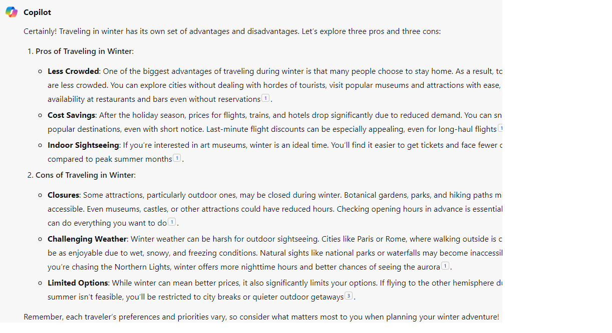
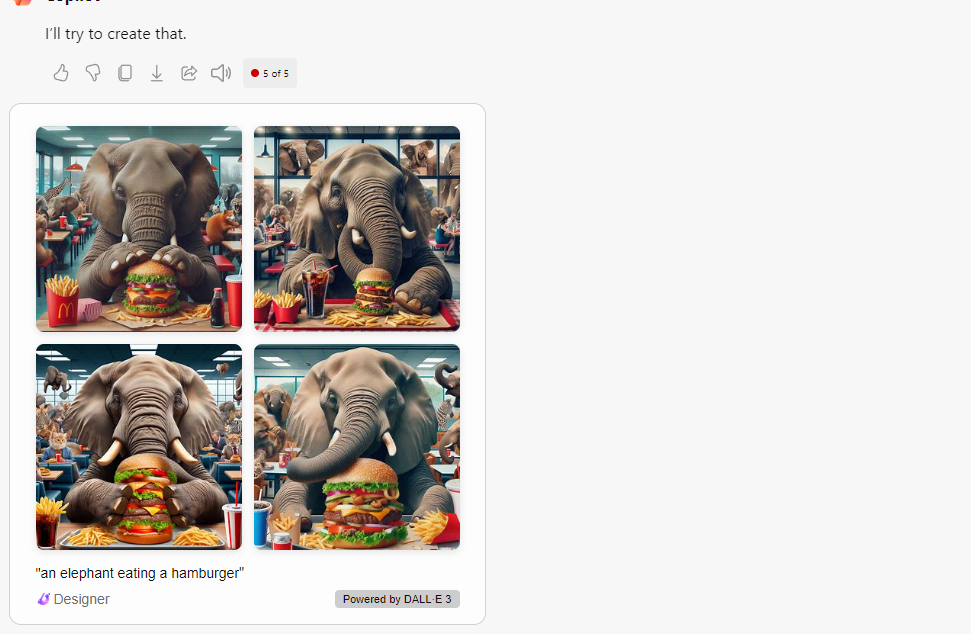

# Desafio-Recursos-de-IA-Generativa-com-Copilot-e-OpenAI
Esse desafio eu acessei o copilot e pedi para ele fazer algumas coisas pra mim 
o primeiro foi:
What are 3 pros and cons of traveling in the winter?
E ele me respondeu isso

Depois eu pedi para ele criar uma imagem de um elefante com hambuger e o resultado foi incrivel

## Depois eu pedi pra ele criar uma lista em Python

fruits = ["apple", "banana", "orange", "grape"]

print("First fruit:", fruits[0])  # Prints "apple"
print("Third fruit:", fruits[2])  # Prints "orange"

fruits.append("kiwi")
print("Updated list:", fruits)  # Prints ["apple", "banana", "orange", "grape", "kiwi"]

print("Number of fruits:", len(fruits))  # Prints 5

## Depois pedi pra refazer em C#

using System;
using System.Collections.Generic;

namespace MyNamespace
{
    class Program
    {
        static void Main(string[] args)
        {
            // Creating a list of fruits
            List<string> fruits = new List<string>
            {
                "apple", "banana", "orange", "grape"
            };

            // Accessing elements in the list
            Console.WriteLine("First fruit: " + fruits[0]); // Prints "apple"
            Console.WriteLine("Third fruit: " + fruits[2]); // Prints "orange"

            // Adding an element to the list
            fruits.Add("kiwi");
            Console.WriteLine("Updated list: " + string.Join(", ", fruits)); // Prints "apple, banana, orange, grape, kiwi"

            // Length of the list
            Console.WriteLine("Number of fruits: " + fruits.Count); // Prints 5
        }
    }
}

e para fechar eu pedi para ele criar uma imagem de uma mulher negra com o seu bebê e fiquei apaixonada no resultado

